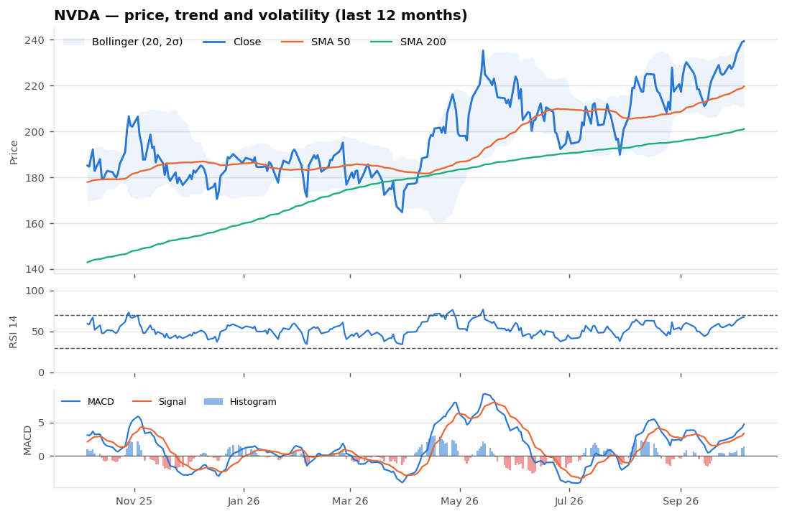

# NVIDIA Corporation (NVDA) — Equity Research Brief
*Data as of 2026-10-06 · generated 2026-10-07 · model `groq/openai/gpt-oss-120b` · prompts v1.0.0*

## Recommendation: **BUY** (medium conviction)
The price is firmly above both the 50‑day and 200‑day SMAs, confirming a sustained bullish regime, while the MACD line sits above its signal with a rising histogram, reinforcing upward momentum. RSI has climbed to 67, indicating strong but not yet exhausted buying pressure, and the positive news sentiment adds fundamental support. However, the stock is trading near the upper Bollinger band and just 1.7% below its 52‑week high, suggesting a short‑term overextension, and volume is slightly below its 20‑day average, hinting at waning participation. Overall, the bullish trend and momentum outweigh these near‑term cautions, supporting a buy recommendation for the next 1‑3 months.

**Key drivers:** price above SMA‑50/200 confirming bullish trend; MACD histogram rising with bullish crossover supporting momentum; RSI climbing yet below overbought within uptrend; Bollinger %B near upper band indicating potential short‑term pullback
**Conflicting signals:** price hugging upper Bollinger band; RSI approaching overbought levels; volume below 20‑day average

## Company snapshot
| Metric | Value |
|---|---|
| Sector | Technology |
| Current price | $239.24 |
| 52-week range | $163.90 – $243.37 (-1.70% from high) |
| P/E (trailing / forward) | 30.25 / 15.14 |
| YTD return | +28.58% |
| Momentum signal | bullish (5/5) |

## Technical outlook
| Indicator | Value |
|---|---|
| SMA 50 / SMA 200 | $219.62 / $201.03 |
| RSI(14) | 67.3 |
| MACD / signal / hist | 4.735 / 3.362 / 1.373 |
| Bollinger lower / mid / upper | $209.52 / $224.88 / $240.23 |
| Bollinger %B | 0.97 |

## News sentiment: positive (+0.622)
Scored 15/15 headlines — 10 positive, 3 neutral, 2 negative.

**Top 3 headlines**

1. *Dan Ives Highlights Nvidia (NVDA) as Top Tech Stock Amid $4T Spe* — **positive** (0.92): Analyst endorsement as top tech stock signals strong demand and likely lifts the share price.
2. *This 1 Quote in Anthropic's IPO Prospectus Should Have AI Investors Buying More Nvidia Stock* — **positive** (0.92): Prospectus praise signals strong demand for Nvidia chips, likely spurring buying pressure on the stock.
3. *Why NVDA, AMD, CRWD Stocks Surged To 52-Week Highs Today* — **positive** (0.92): A 52‑week high indicates strong buying pressure and positive market sentiment toward NVIDIA.

---
**Risk disclaimer.** This brief was generated automatically by an LLM-assisted research pipeline for a technical assessment. It is not investment advice, an offer or a solicitation to buy or sell any security. Technical indicators are backward-looking, news sentiment is model-estimated and may be wrong, and the recommendation ignores valuation, fundamentals, macro conditions and your personal circumstances. Markets involve risk, including loss of principal. Verify all data independently and consult a licensed adviser before making any investment decision.