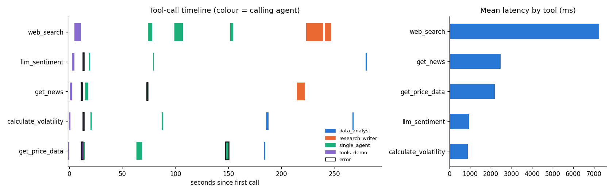

# Task 3 — Multi-Agent Financial Research System (LangGraph)

[](https://colab.research.google.com/github/nazifmhd/Task-1---Financial-AI/blob/main/task3_agentic/task3_agentic.ipynb)

**Executed notebook:** [`task3_agentic.ipynb`](task3_agentic.ipynb) · **Trace:** [`logs/agent_trace.jsonl`](logs/agent_trace.jsonl) · **Cache:** [`cache/`](cache/) · **Dashboard:** [`dashboard.py`](dashboard.py)



## Architecture
```
tools.py ── 5 StructuredTools, each @traced ──► logs/agent_trace.jsonl  (tool, inputs, output[:200], duration_ms,
   │                                                                     agent, run_id, status, ts)
   ├── 3A single_agent.py : create_react_agent(all 5 tools) + MemorySaver + pre_model_hook
   │                        ReAct loop, then a Pydantic FinalReport (3 sections)
   └── 3B multi_agent.py  : StateGraph
          analyst_brief ──DataBrief──► writer_review ──ClarificationRequest──► analyst_clarify
                                           │ (sufficient)                        │ ClarificationResponse
                                           └───────────────► writer_report ◄─────┘ ──► FinalReport ──► END
   3C memory.py           : cache/{TICKER}_{YYYY-MM-DD}.json (checked before any agent runs)
```

| Requirement | Where / how |
|---|---|
| Five tools with correct types | `src/tools.py`. dict: price (OHLCV + SMA50/200, Wilder RSI, MACD, Bollinger), volatility, sentiment. list[dict]: news, search. Errors come back as `{"error", "hint"}`; tools never raise. |
| Autonomous tool selection | ReAct agent with no fixed order. Three runs (NVDA, MSFT with a news outage, a fake ticker) produce different tool plans. |
| Observe → replan | `ACTION`/`OBSERVE` lines in the notebook. `replan_events()` marks where an error changed the next action (e.g. `get_news` outage → `web_search`). |
| Error handling | Structured tool errors, `inject_faults()` for outages, a fake-ticker run, schema fallbacks for structured output, and graceful recursion-limit handling. |
| Distinct roles + enforced restriction | Each agent is built only with its own tool objects. The notebook shows A's ToolNode rejecting `web_search`, and an agent × tool matrix from the trace. |
| Structured handoff | `DataBrief`, `ClarificationRequest`, `ClarificationResponse`, `FinalReport` (Pydantic) held in graph state. |
| Critique loop | B reviews A's brief against what the report needs (90-day hedge horizon; sentiment that A cannot get without news). B sends one request that carries the headlines it fetched, A answers with its own tools, and B incorporates the answer. Capped at one round. |
| Short-term memory | Checkpointer thread. The follow-up question logs **0** tool calls. |
| Persistent cache | Second `research("NVDA")` prints `[CACHE HIT]` and makes 0 tool calls (trace). |
| Observability bonus | Streamlit `dashboard.py` (executed headlessly via `AppTest` in the notebook), plus the static preview above. |

## Engineering decisions
* **LangGraph** gives explicit state and conditional edges, so the replan cycle and the critique loop are inspectable graph structure rather than prompt conventions.
* **Context management:** the Groq free tier allows about 7–8k input tokens per minute. A `pre_model_hook` shortens *older* observations in each prompt (full results stay in memory) and enforces a per-agent tool budget, so long explorations never exceed the limit.
* **Models (chosen from free-tier limits):** agents run on `openai/gpt-oss-20b`, and the low-volume `llm_sentiment` tool on `openai/gpt-oss-120b`, a separate model with its own rate limits. `qwen/qwen3.8-27b` was tried, but it caps output at 1k tokens per minute, which is too little for report writing. Both models are configurable via `AGENT_MODEL` and `SENTIMENT_MODEL`.
* **Search robustness:** DuckDuckGo backends fail intermittently, so `web_search` tries `auto` and then `yahoo` before returning an error.
* **Restriction is structural, not a prompt instruction.** The trace records *which agent* made each call, so the restriction can be audited after the fact.

## Run
```bash
cd task3_agentic
python -m venv --system-site-packages .venv && .venv/Scripts/pip install -r requirements.txt   # (or plain pip on Colab)
echo GROQ_API_KEY=... > .env            # git-ignored; in Colab use Secrets
.venv/Scripts/python -m pytest          # 8 offline tests (no LLM / network)
.venv/Scripts/python -m jupyter nbconvert --to notebook --execute --inplace task3_agentic.ipynb
streamlit run dashboard.py              # bonus dashboard
```
